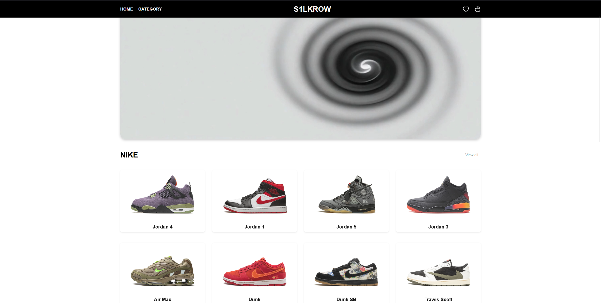

# 🏆 S1LKROW - Online Sneaker Store

**S1LKROW** is a website for an online sneaker store, offering a wide selection of brands and models. Users can browse different categories and collections, including popular models from **Nike**, **Adidas**, **Timberland**, and other brands.

## 🌟 Features

- **🗂️ Product Categories**: All sneakers are organized by brand and model.
- **🔗 Interactive Menu**: Navigation includes sections for **[Home](#)** and **[Categories](#)**, as well as buttons for **search**, **cart**, and **favorites**.
- **📦 Product Display**: Product cards are organized in rows of four with navigation buttons for easy browsing.
- **📱 Responsive Design**: Supports various screen resolutions for correct display on both desktops and mobile devices.

## 📁 Project Structure

- **center/cart** — contains folders with images and data for each sneaker brand and model.
- **footer** — contains SVG icons for payment systems (Apple Pay, Google Pay, Visa, Mastercard).
- **head** — contains SVG icons for **cart**, **favorites**, **search**, and **user profile** buttons.
- **index.html** — the main HTML file containing the page structure.
- **script.js** — JavaScript file for interactive elements on the page.
- **style.css** — CSS file for styling and positioning elements on the page.



## 🚀 Installation and Launch

1. Clone the repository:
   ```bash
   git clone https://github.com/card-stoner/www.git
